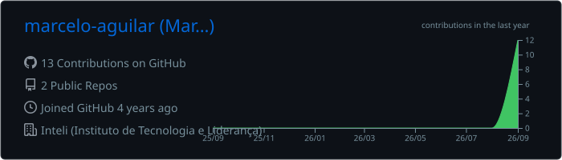
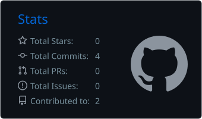

# Olá, eu sou o Marcelo Aguilar 👋

**Estudante de Engenharia de Software** · Desenvolvimento Web · Dados · Cibersegurança

<!-- Descomente e preencha os links abaixo:

-->

---

## 🧑‍💻 Sobre mim

Sou estudante de Engenharia de Software e gosto de entender como as coisas funcionam por dentro — do código ao sistema operacional.

- Interesse em **desenvolvimento de software**, **dados** e **cibersegurança**
- Aprendendo continuamente novas tecnologias e colocando em prática por meio de projetos
- Construindo meu portfólio com projetos reais, como o site da minha própria barbearia

---

## 🛠️ Tecnologias

---

## 📊 Estatísticas no GitHub

---

## 🚀 Projetos em destaque

| Projeto | Descrição | Tecnologias |
| :-- | :-- | :-- |
| [**site-barbearia-X**](https://github.com/0lecr4m/site-barbearia-X) | Site que desenvolvi para a minha própria barbearia. | JavaScript |

<!-- Adicione novos projetos seguindo o modelo:
| [**NOME DO PROJETO**](LINK DO REPOSITÓRIO) | Breve descrição do projeto | Tecnologias |
-->

---

## 📫 Contato

Aberto a conversas sobre tecnologia, estágios e projetos.

<a href="https://www.linkedin.com/in/marcelo-aguilar-">LinkedIn</a> ·
<a href="https://github.com/0lecr4m">GitHub</a>
<!-- · <a href="mailto:[SEU EMAIL]">Email</a> · <a href="[LINK DO PORTFÓLIO]">Portfólio</a> -->

