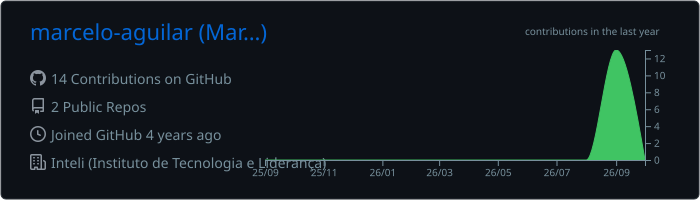
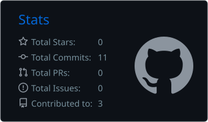
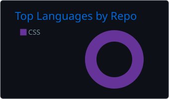
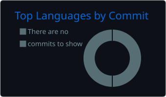

<div align="center">

# Hello, i am Marcelo Aguilar 👋

**software engineer** · Full-Stack Development · AI - Data Analysis e Machine Learning · cybersecurity

<a href="https://www.linkedin.com/in/marcelo-aguilar-"></a>
<!-- Descomente e preencha os links abaixo:
<a href="mailto:[SEU EMAIL]"></a>
<a href="[LINK DO PORTFÓLIO]"></a>
-->

</div>

---

##  About me

I’m a Software Engineering student at Inteli, driven by curiosity and a genuine interest in understanding how technology works and how it can be used to create meaningful solutions.

For me, programming is more than writing code. It is a way of thinking, exploring ideas, solving problems, and turning concepts into something tangible. I enjoy the process of breaking down complex problems, experimenting with different approaches, learning from mistakes, and continuously improving what I build.

I’m deeply interested in the world of technology and the possibilities it creates. I enjoy exploring different areas of tech, understanding how they connect, and discovering new ways to apply technology to real-world problems. I’m still exploring the paths I want to follow, and I see that process of exploration as an important part of becoming a well-rounded professional.

I believe that technology is constantly evolving, and so should we. That’s why I value curiosity, adaptability, creativity, and continuous learning. I want to build things that challenge me, learn from the people around me, and grow through every project and experience.

<table>
<tr>
<td width="60%" valign="top">

```json
{
  "name": "Marcelo Aguilar",
  "role": "Software Engineering Student",
  "university": "Inteli",
  "location": "[CIDADE, PAÍS]",
  "currentlyLearning": ["[TECNOLOGIA 1]", "[TECNOLOGIA 2]"],
  "currentlyWorkingOn": "[PROJETO ATUAL]",
  "interests": ["Full-Stack", "AI & Machine Learning", "Cybersecurity"],
  "languages": ["Portuguese", "English"],
  "funFact": "[CURIOSIDADE SOBRE VOCÊ]",
  "contact": "[SEU EMAIL]"
}
```

</td>
<td width="40%" align="center" valign="middle">

<!-- Troque o src abaixo pela sua imagem (ex.: ./assets/me.gif ou um link externo) -->


</td>
</tr>
</table>

---

##  Technologies

<div align="center">


</div>

---

##  GitHub Analytics

<div align="center">







</div>

---

<div align="center">

Aberto a conversas sobre tecnologia, estágios e projetos.

<a href="https://www.linkedin.com/in/marcelo-aguilar-">LinkedIn</a> ·
<a href="https://github.com/marcelo-aguilar">GitHub</a>
<!-- · <a href="mailto:[SEU EMAIL]">Email</a> · <a href="[LINK DO PORTFÓLIO]">Portfólio</a> -->

</div>
